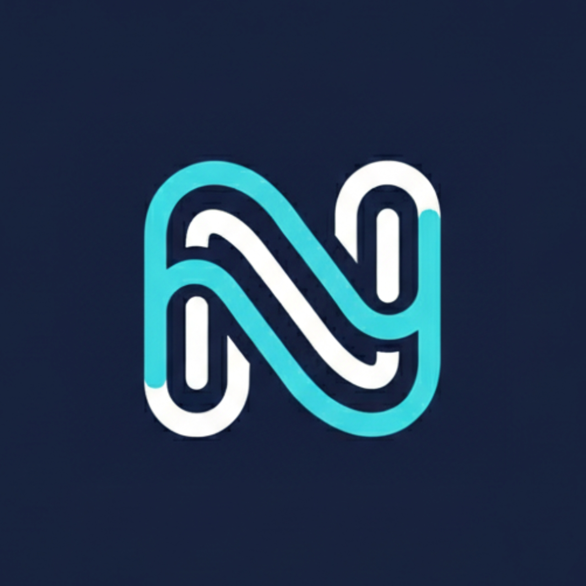

  
  <h1>NGETIKIN</h1>
  
<strong>Komunitas Web Development untuk Indonesia</strong> Ilmu itu gratis, tapi harus dibayar dengan konsistensi.

  <a href="https://ngetikin.vercel.app">Live site</a> · <a href="https://wa.me/6285117121912">WhatsApp</a> · <a href="mailto:ngetikin.community@gmail.com">Email</a>

---

## 🚀 Apa itu NGETIKIN?

NGETIKIN adalah komunitas web development berbasis Discord untuk Indonesia dengan sistem pembelajaran terstruktur, berbasis komitmen, dan keaktifan. Mengusung tagline "Ilmu itu gratis, tapi harus dibayar dengan konsistensi.", NGETIKIN berfokus pada pemula 0, namun tetap terbuka untuk semua level. Kami percaya bahwa hambatan terbesar belajar coding bukan kurangnya materi, melainkan kurangnya konsistensi, disiplin, dan lingkungan belajar yang sehat.

## 🎯 Visi & Misi
- **Visi:** Menjadi komunitas web development paling berdampak di Indonesia dalam membentuk developer yang konsisten, disiplin, dan siap bertumbuh jangka panjang.
- **Misi:**
  1) Menyediakan sistem pembelajaran web development yang terstruktur dan aplikatif.
  2) Membangun budaya belajar berbasis konsistensi dan keaktifan.
  3) Menjadi jembatan antara pembelajar dan dunia profesional secara realistis.
  4) Mengedukasi tanpa menjual mimpi instan atau overpromise karier.

## 🧭 Siapa yang Cocok Bergabung?
Pemula dalam coding · developer yang ingin meningkatkan konsistensi · siapa pun yang percaya bahwa skill dibangun pelan-pelan melalui konsistensi · mereka yang mencari lingkungan belajar yang sehat dan mendukung.

## 📚 Program & Layanan
- **Program Fullstack Web Development:** Pembelajaran terstruktur dari dasar hingga mahir.
- **Weekly Challenge & Task:** Tantangan mingguan untuk meningkatkan keterampilan dan membangun portofolio.
- **Mentoring 1-on-1:** Sesi mentoring pribadi untuk membantu perkembangan individu.
- **Event & Workshop Intensif:** Workshop berkala untuk membahas topik spesifik.
- **Job & Project Board:** Platform eksklusif untuk anggota aktif yang mencari peluang kerja.

## 💡 Nilai Inti & Kenapa Memilih NGETIKIN
- 💪 **Komitmen Lebih dari Bakat:** Konsistensi lebih penting daripada bakat alami.
- 🤝 **Lingkungan Belajar Serius:** Santai dalam komunikasi, disiplin dalam proses belajar.
- 📚 **Belajar Melalui Praktik:** Praktik nyata lebih utama daripada teori semata.
- 👥 **Komunitas Di Atas Ego:** Tumbuh bersama, bukan pamer kemampuan.
- 🤲 **Tanpa Janji Palsu:** Tidak menjual narasi cepat jago atau karier instan.

## 🔗 Kontak
- WhatsApp: **+62 851-1712-1912** — https://wa.me/6285117121912
- Email: **ngetikin.community@gmail.com** — mailto:ngetikin.community@gmail.com
- Discord: **dsc.gg/ngetikin** — https://dsc.gg/ngetikin
- Website: **[ngetikin.vercel.app](https://ngetikin.vercel.app)**
- Instagram: **@ngetikin**
- TikTok: **@ngetikin**
- Twitter: **@ngetikin**
- Threads: **@ngetikin**
- YouTube: **@ngetikinid**

## 🛠️ Teknologi & Stack (repo ini)
- Next.js 16, React 19
- Tailwind CSS v3
- TypeScript
- GSAP untuk animasi

## 🤲 Bergabung dengan Kami
Kami selalu terbuka untuk anggota baru yang serius belajar dan berkomitmen untuk berkembang.
👉 Bergabunglah dengan komunitas yang percaya bahwa skill dibangun pelan-pelan melalui konsistensi.

---

> “Ilmu itu gratis, tapi harus dibayar dengan konsistensi.” — Kami percaya bahwa konsistensi selalu lebih penting daripada bakat alami.
